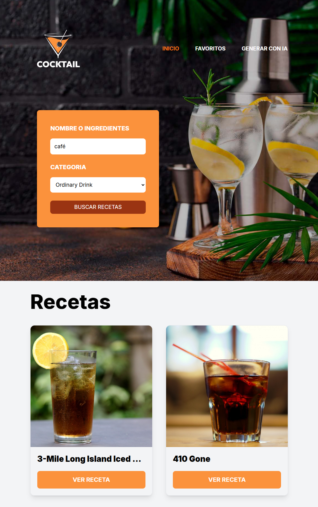

  

# BarmanAI 🍸

Aplicación web para generar recetas y cócteles personalizados con Inteligencia Artificial.

👉 **Prueba la app:** [https://barmanai.netlify.app/](https://barmanai.netlify.app/)

---

## 🚀 Finalidad

BarmanAI es una plataforma que permite a cualquier usuario generar recetas de bebidas y cócteles personalizados usando IA. Solo tienes que escribir los ingredientes o el tipo de bebida que deseas, y la IA te sugerirá recetas creativas, pasos de preparación y alternativas.

## 🧠 ¿Por qué es especial?

- Utiliza modelos de IA para crear recetas únicas y adaptadas a tus gustos.
- Puedes pedir recetas con ingredientes específicos, estilos, o pedir alternativas.
- Guarda el historial de tus búsquedas y recetas generadas.
- Interfaz tipo chat para una experiencia conversacional.

## 🏗️ Arquitectura

- **Frontend:** React + TypeScript + Vite
- **Estado global:** Zustand
- **Estilos:** TailwindCSS
- **Consumo de IA:** API de OpenRouter (modelos LLM)
- **Persistencia:** localStorage para historial de recetas
- **Vista previa:**

  

## 📁 Estructura principal

- `src/views/GenerateAI.tsx`: Vista principal para interactuar con la IA.
- `src/services/AIService.ts`: Lógica para consumir la API de IA.
- `src/stores/aiSlice.ts`: Estado global y acciones de IA.
- `public/presentation.png`: Imagen de la app en funcionamiento.

## ✨ ¿Qué puedes hacer?

- Generar recetas de cócteles y bebidas personalizadas.
- Consultar el historial de recetas generadas.
- Recibir sugerencias creativas y alternativas.

---

Desarrollado con ❤️ por JPalacio
